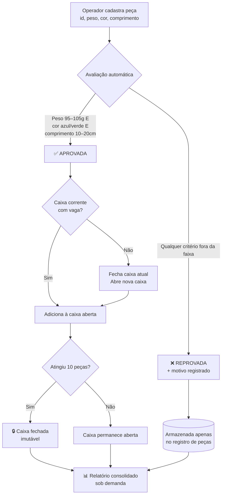

# 🏭 Sistema de Gestão de Peças, Qualidade e Armazenamento

[](https://github.com/clebson-scott/gestao-pecas-qualidade/actions/workflows/ci.yml)


> Trabalho da disciplina **Algoritmos e Lógica de Programação** — UniFECAF
> Desafio: *"Desafio de Automação Digital: Gestão de Peças, Qualidade e Armazenamento"*
> Autor: **Clebson Scott**

Protótipo em Python que automatiza a inspeção de qualidade e o
armazenamento de peças de uma linha de montagem — substituindo um
processo manual sujeito a atrasos, falhas de conferência e custo alto de
operação por um fluxo determinístico, testado e auditável.

---

## Índice

1. [O problema](#-o-problema)
2. [A solução, em uma imagem](#-a-solução-em-uma-imagem)
3. [Regras de negócio implementadas](#-regras-de-negócio-implementadas)
4. [Arquitetura do código](#-arquitetura-do-código)
5. [Como instalar e executar](#-como-instalar-e-executar)
6. [Como usar — passo a passo com exemplos reais](#-como-usar--passo-a-passo-com-exemplos-reais)
7. [Testes automatizados](#-testes-automatizados)
8. [Decisões de projeto e por quê](#-decisões-de-projeto-e-por-quê)
9. [Limitações conhecidas](#-limitações-conhecidas)
10. [Roadmap — como isso evoluiria num cenário real](#-roadmap--como-isso-evoluiria-num-cenário-real)
11. [Estrutura de arquivos](#-estrutura-de-arquivos)
12. [Licença](#-licença)

---

## 🎯 O problema

Numa linha de montagem que ainda inspeciona peças manualmente, três coisas
dão errado com frequência:

| Problema manual | Consequência |
|---|---|
| Conferência visual/humana de peso, cor e comprimento | Erros de julgamento, fadiga do operador, inconsistência entre turnos |
| Contagem manual de peças por caixa | Caixas com quantidade errada, atraso na expedição |
| Relatórios feitos em planilha, depois do fim do turno | Decisão tardia — o problema já aconteceu 500 peças atrás |

Este sistema resolve os três pontos com uma regra simples: **toda peça é
avaliada no instante do cadastro**, contra critérios fixos e auditáveis, e
o relatório está sempre pronto, em tempo real, com um clique.

## 🧩 A solução, em uma imagem



## ✅ Regras de negócio implementadas

| Critério | Regra | Onde no código |
|---|---|---|
| Peso | `95g ≤ peso ≤ 105g` (limites inclusivos) | `regras.py::avaliar_peso` |
| Cor | `azul` ou `verde` (aceita variações de digitação/acentuação) | `regras.py::avaliar_cor` |
| Comprimento | `10cm ≤ comprimento ≤ 20cm` (limites inclusivos) | `regras.py::avaliar_comprimento` |
| Armazenamento | Caixas de 10 peças; fecha automaticamente e abre a próxima | `models.py::Caixa.adicionar` |
| Imutabilidade | Caixa fechada não aceita adição/remoção — rastreabilidade de lote | `models.py::Caixa`, `estoque.py::remover_peca` |
| Relatório | Total aprovadas, total reprovadas **com motivo**, caixas utilizadas | `estoque.py::gerar_relatorio_final` |

> **Nota de transparência:** o desafio não especifica se os limites das
> faixas são inclusivos ou exclusivos. Adotamos a leitura inclusiva
> (95g e 105g são aprovados), documentada explicitamente no código
> (`regras.py`) e no relatório teórico — decisão de projeto, não uma
> lacuna escondida.

## 🏗️ Arquitetura do código

O sistema segue separação de responsabilidades em camadas — cada módulo
tem **uma única razão para mudar**:

```
main.py          → Interface (CLI): input/print, menu, nada de regra de negócio
      │
      ▼
estoque.py       → Orquestração: GerenciadorProducao (cadastro, remoção, relatório)
      │
      ├──► regras.py        → Critérios de aprovação/reprovação (puro, sem estado)
      ├──► models.py        → Peca, Caixa, CorPeca, StatusPeca (estruturas de dados)
      ├──► excecoes.py      → Exceções de domínio (PecaDuplicadaError, etc.)
      └──► persistencia.py  → Salvar/carregar estado em JSON
```

Essa separação não é acadêmica: ela é o que permite, por exemplo, testar
`regras.py` inteiramente sem precisar de um terminal, um arquivo ou um
banco de dados — e é o que permitiria, no futuro, plugar o mesmo
`GerenciadorProducao` numa API REST sem tocar em uma linha de regra de
negócio (ver [Roadmap](#-roadmap--como-isso-evoluiria-num-cenário-real)).

## 🚀 Como instalar e executar

**Pré-requisito:** Python 3.10 ou superior ([python.org.br](https://python.org.br/)).
O sistema **não tem dependências externas** para funcionar — só a
biblioteca padrão do Python.

```bash
# 1. Clone o repositório
git clone https://github.com/clebson-scott/gestao-pecas-qualidade.git
cd gestao-pecas-qualidade

# 2. (Opcional, só para rodar os testes) Instale as dependências de dev
pip install -r requirements.txt

# 3. Execute o sistema (menu interativo)
python3 -m pecas_qualidade.main

# 4. Ou rode a demonstração automática (sem digitar nada)
python3 -m pecas_qualidade.demo
```

Se preferir rodar diretamente o arquivo (sem `-m`), também funciona:

```bash
cd pecas_qualidade
python3 main.py
```

## 🖥️ Como usar — passo a passo com exemplos reais

Ao iniciar, o sistema mostra o menu principal:

```
========================================================
                     MENU PRINCIPAL
========================================================
 1. Cadastrar nova peça
 2. Listar peças aprovadas/reprovadas
 3. Remover peça cadastrada
 4. Listar caixas fechadas
 5. Gerar relatório final
 0. Sair
========================================================
 Escolha uma opção:
```

### 1. Cadastrar nova peça

**Entrada:**
```
Escolha uma opção: 1

--- Cadastro de nova peça ---
ID da peça: P001
Peso (g): 100
Cor (ex.: azul, verde, vermelha...): azul
Comprimento (cm): 15
```

**Saída:**
```
  ✔ Peça APROVADA e armazenada na Caixa #1.
```

Testando agora uma peça fora dos critérios:

**Entrada:**
```
ID da peça: P002
Peso (g): 50
Cor (ex.: azul, verde, vermelha...): preta
Comprimento (cm): 5
```

**Saída:**
```
  ✗ Peça REPROVADA. Motivo(s): peso 50.0g fora da faixa aceita [95g – 105g],
  cor 'Preta' não aceita (exigido: Verde ou Azul), comprimento 5.0cm fora
  da faixa aceita [10cm – 20cm].
```

> Note que o sistema reporta **todos** os motivos de reprovação de uma
> vez — não só o primeiro problema encontrado. Isso ajuda o time de
> produção a diagnosticar a causa raiz sem precisar reenviar a peça
> várias vezes.

### 2. Listar peças aprovadas/reprovadas

```
Escolha uma opção: 2

--- Listagem de peças ---
 1. Ver aprovadas
 2. Ver reprovadas
 3. Ver todas
 Escolha uma opção: 1

PEÇAS APROVADAS (1):
  Peça #P001 | 100.0g | Azul | 15.0cm | Aprovada [Caixa #1]
```

### 3. Remover peça cadastrada

```
Escolha uma opção: 3

--- Remoção de peça ---
ID da peça a remover: P002
  ✔ Peça removida: Peça #P002 | 50.0g | Preta | 5.0cm | Reprovada (...)
```

Se a peça estiver numa **caixa já fechada**, a remoção é bloqueada de
propósito (ver [Decisões de projeto](#-decisões-de-projeto-e-por-quê)):

```
ID da peça a remover: P001
  ✗ Erro: A peça 'P001' está na caixa #1, que já está fechada e é
  imutável. Remoção não permitida.
```

### 4. Listar caixas fechadas

```
Escolha uma opção: 4

--- Caixas fechadas ---
  Caixa #1 [FECHADA] — 10/10 peças — peças: P001, P003, P004, ...
```

### 5. Gerar relatório final

```
Escolha uma opção: 5

========================================================
 RELATÓRIO CONSOLIDADO DE PRODUÇÃO E QUALIDADE
========================================================
Total de peças cadastradas ..................... 15
Total de peças APROVADAS ....................... 12
Total de peças REPROVADAS ...................... 3
Taxa de aprovação ............................... 80.0%
--------------------------------------------------------
Motivos de reprovação (peças podem ter mais de um):
  - peso 200.0g fora da faixa aceita [95g – 105g]: 1 ocorrência(s)
  - cor 'Vermelha' não aceita (exigido: Verde ou Azul): 1 ocorrência(s)
  - comprimento 50.0cm fora da faixa aceita [10cm – 20cm]: 1 ocorrência(s)
--------------------------------------------------------
Caixas utilizadas (abertas + fechadas) ......... 2
  - fechadas (capacidade máxima atingida) ...... 1
  - em aberto (aguardando novas peças) ......... 1
========================================================

(Relatório também exportado para: .../relatorio_final.txt)
```

O relatório é **exportado automaticamente** para `relatorio_final.txt` —
útil para anexar a um e-mail ou sistema de qualidade.

## 🧪 Testes automatizados

O sistema tem **54 testes automatizados** (`pytest`) com **cobertura de
98%** do código, em três famílias:

1. **Unitários** (`test_regras.py`, 10 testes): cada critério de qualidade
   isolado, incluindo os limites exatos (95g, 105g, 10cm, 20cm) e a
   normalização de cores digitadas com variação ("AZUL", " verde ",
   "Vermelho").
2. **De integração do CLI** (`test_cli.py`, 23 testes): simulam sessões
   completas de usuário — sequências de teclado reais alimentando o menu,
   verificando as mensagens impressas. Se o menu quebrar, o teste pega.
3. **De robustez** (`test_robustez.py`, 18 testes + 3 smoke tests da demo em `test_demo.py`): invariantes de caixa
   (fechada é imutável), arquivo de estado corrompido, caminho de disco
   inválido — o sistema continua operando em vez de quebrar.

Cobrindo casos de borda que um trabalho manual dificilmente cobriria — por
exemplo, o que acontece exatamente na 10ª e na 11ª peça aprovada:

```bash
pytest tests/ -v
```

```bash
pytest tests/ -v
# 54 passed — cobertura: 98,12%
```

Além dos testes, o repositório tem um **portão de qualidade** que precisa
estar 100% verde para qualquer contribuição entrar:

```bash
make qualidade   # ruff (estilo + padrões de bug) → mypy (tipagem) → pytest
```

| Porta                        | Ferramenta | Estado  |
|------------------------------|------------|---------|
| Estilo e padrões de bug      | `ruff`     | 0 violações |
| Tipagem estática              | `mypy`     | 0 erros |
| Testes automatizados          | `pytest`   | 54/54   |
| Cobertura mínima exigida       | `coverage` | 95% (atual: 98%) |

Um workflow de **Integração Contínua** (`.github/workflows/ci.yml`) roda
essa suíte automaticamente em Python 3.10, 3.11 e 3.12 a cada `push` —
prática comum em times profissionais de software para garantir que
nenhuma alteração futura quebre uma regra já validada.

## 🧠 Decisões de projeto e por quê

Estas são escolhas conscientes, não acidentes — documentadas aqui para
transparência de banca/avaliador:

1. **`dataclasses` em vez de dicionários soltos** (`models.py`): tipagem
   clara, autocompletar no editor, e impossível esquecer um campo
   obrigatório na criação de uma peça.
2. **Enums (`StatusPeca`, `CorPeca`) em vez de strings mágicas**: elimina
   uma classe inteira de bugs de digitação (`"aprovada"` vs `"Aprovada"`
   vs `"APROVADA"`) e documenta, no próprio tipo, quais valores são
   válidos.
3. **Regras de negócio isoladas em `regras.py`, sem nenhum estado**: cada
   função (`avaliar_peso`, `avaliar_cor`, `avaliar_comprimento`) é pura —
   recebe um valor, devolve um veredito. Isso as torna triviais de testar
   e de auditar isoladamente.
4. **Caixa fechada é imutável**: uma vez que uma caixa atinge 10 peças e
   fecha, nenhuma peça pode ser adicionada ou removida dela. Isso
   espelha uma prática real de controle de qualidade industrial — um
   lote lacrado precisa permanecer rastreável e auditável, exatamente
   como foi fechado.
5. **Persistência em JSON legível, não binário**: qualquer pessoa pode
   abrir `estado_producao.json` num editor de texto comum e auditar
   exatamente o que o sistema tem armazenado — relevante em um contexto
   de rastreabilidade industrial e de auditoria de qualidade.
6. **Todos os motivos de reprovação são reportados, não só o primeiro**:
   uma peça que falha em peso E cor deve mostrar os dois problemas de
   uma vez, para o time de produção corrigir a causa raiz sem
   repetições desnecessárias.
7. **Exceções de domínio específicas** (`PecaDuplicadaError`,
   `RemocaoBloqueadaError`, ...) em vez de `Exception` genérica: quem lê
   o código entende imediatamente qual regra foi violada.
8. **Zero dependências externas para rodar** (só para os testes): reduz
   o atrito de instalação para o avaliador e para qualquer ambiente de
   fábrica restrito.

## ⚠️ Limitações conhecidas

Nenhum sistema é perfeito, e listar as limitações com honestidade é, em
si, boa prática de engenharia:

- **Concorrência**: o sistema foi desenhado para um único operador por
  vez (execução via terminal). Não há bloqueio de arquivo para múltiplos
  processos escrevendo `estado_producao.json` simultaneamente.
- **Capacidade de caixa fixa em 10** por especificação do desafio — o
  código já suporta capacidade configurável (`Caixa.capacidade_maxima`),
  mas o menu não expõe essa configuração ao usuário final.
- **Sem interface gráfica**: é um protótipo de terminal (CLI), como
  pedido no desafio. A arquitetura em camadas foi feita exatamente para
  que isso não seja um obstáculo a uma evolução futura (ver Roadmap).
- **Validação de cor por lista fechada** (`CorPeca`): cores fora da
  lista pré-cadastrada são rejeitadas na entrada, não simplesmente
  reprovadas na avaliação. Isso é intencional (evita erros de
  digitação silenciosos), mas significa que uma cor legítima nova
  exigiria adicionar um valor ao Enum.

## 🗺️ Roadmap — como isso evoluiria num cenário real

Esta seção responde diretamente à reflexão final pedida no desafio.

| Da situação atual (protótipo)... | ...para um cenário real de produção |
|---|---|
| Peso/comprimento digitados manualmente | **Sensores IoT** (balança digital + sensor a laser/ultrassônico) enviando os dados via MQTT/Modbus diretamente para `GerenciadorProducao.cadastrar_peca()` — a lógica de avaliação não mudaria uma linha |
| Cor identificada por texto digitado | **Visão computacional** (câmera + modelo de classificação de cor, ex.: OpenCV + um classificador leve) substituindo o `input()` de cor por uma leitura automática |
| Reprovação apenas registrada em log | **Atuador físico** (esteira com desvio pneumático) acionado no momento em que `resultado.aprovada is False`, desviando a peça automaticamente para a linha de retrabalho |
| Persistência em arquivo JSON local | **Banco de dados real** (PostgreSQL/TimescaleDB) para volume industrial, com dashboards em tempo real (Grafana) sobre a mesma camada de domínio |
| Relatório gerado sob demanda no terminal | **Alertas proativos**: um serviço rodando `GerenciadorProducao` num loop de fábrica poderia notificar o supervisor via Slack/e-mail automaticamente quando a taxa de reprovação de um motivo específico ultrapassar um limiar (indício de problema na matéria-prima ou na calibração da máquina) |
| IA aplicada | Um modelo de **manutenção preditiva** poderia correlacionar o histórico de reprovações por motivo com dados de vibração/temperatura da máquina, prevendo falhas de calibração antes que gerem lotes inteiros fora do padrão |
| Execução single-user no terminal | **API REST** (FastAPI) expondo os mesmos métodos de `GerenciadorProducao` para múltiplas estações da linha de montagem simultaneamente, com um banco central substituindo o JSON local |

O ponto central desta seção — e da arquitetura em camadas do projeto — é
que **nenhuma dessas evoluções exigiria reescrever a lógica de negócio**
em `regras.py` ou `estoque.py`. Elas trocariam apenas as "bordas" do
sistema (como os dados entram e como os resultados saem), que é
exatamente o que a separação entre interface e domínio foi desenhada
para permitir.

## 📁 Estrutura de arquivos

```
gestao-pecas-qualidade/
├── pecas_qualidade/
│   ├── __init__.py
│   ├── main.py            # Interface CLI (menu interativo)
│   ├── estoque.py         # GerenciadorProducao — orquestração central
│   ├── regras.py          # Critérios de aprovação/reprovação
│   ├── models.py          # Peca, Caixa, CorPeca, StatusPeca
│   ├── excecoes.py        # Exceções de domínio
│   └── persistencia.py    # Salvar/carregar estado em JSON
├── tests/
│   ├── test_regras.py     # 10 testes — critérios de qualidade isolados
│   ├── test_estoque.py     # 11 testes — núcleo de negócio (caixas, remoção, relatório)
│   ├── test_cli.py         # 23 testes — sessões completas de usuário simuladas
│   ├── test_robustez.py    # 18 testes — invariantes, corrompimentos, caminhos de erro
│   └── test_demo.py       # 3 testes — smoke tests da demonstração automática
├── .github/workflows/
│   └── ci.yml              # Portão de qualidade: ruff → mypy → pytest (3 versões de Python)
├── pecas_qualidade/demo.py # Demonstração automática (cenario completo sem digitação)
├── RELATORIO_TECNICO.md    # Parte teórica exigida pelo desafio (Análise e Discussão)
├── VIDEO_PITCH_SCRIPT.md   # Roteiro do vídeo pitch (até 4 minutos)
├── CHANGELOG.md            # Histórico de versões (Keep a Changelog)
├── Makefile                # make qualidade / make testes / make demo
├── pyproject.toml          # Configuração padrão da comunidade (ruff, mypy, pytest, coverage)
├── requirements.txt
├── .gitignore
├── LICENSE
└── README.md               # este arquivo
```

## 📄 Licença

Distribuído sob a licença MIT — ver [`LICENSE`](LICENSE).

---

<p align="center">
Desenvolvido por <b>Clebson Scott</b> para a disciplina de Algoritmos e
Lógica de Programação — UniFECAF.
</p>
